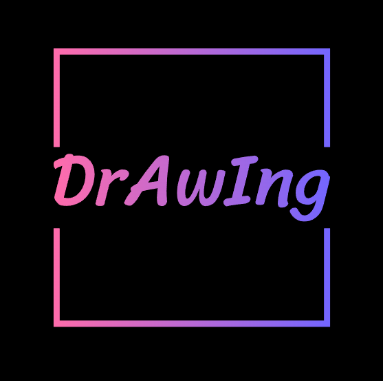
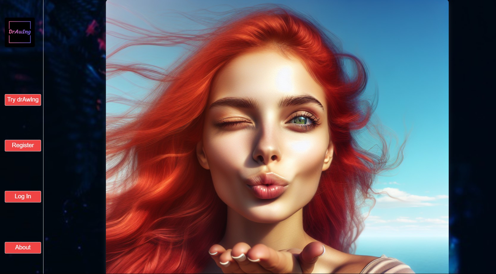
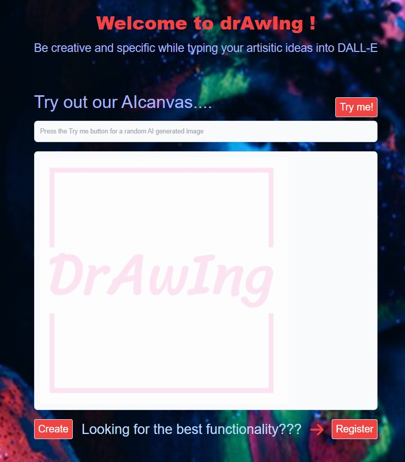

Welcome to drAwIng app, this application allows users to merge their creativity and the power of Dall-E library which provides a database that allows users to via Input create amazing and unique AI images. 

Dall-e is an AI system that can create  realistic images and art from a description in natural language, the library also creates original, realistic images and art from a text description. It can combine concepts, attributes and styles.

The design of the application is simple but functional, the user is offered to try Dall-e library by generating an image from  a list of prewritten prompts. After the prompt is selected  the user can press the create button to see the image that has been generated.

Users will ONLY have access to create their own prompt as well as  upload the picture into drAwIng gallery upon registration.

TECHNOLOGIES USED:
- OpenAI Dall-E library.
- MERN stack.
- JavaScript.
- Cloudinary.
- FontAwesome
- TailWind
- Bcrypt
- JsonWebToken
- Axios

UNSOLVED ISSUES:
* Users are not able to see their own images in a private gallery.
* App is not responsive.
* Images cannot be downloaded.

FUTURE ENHANCEMENTS:
-> Users would be able to comment and rank other users' canvases.
-> Easy step  by step guide to put together the best possible prompt.
-> Users would be able to build their own frames to surround their canvases.
-> drAwIng store that accept cryptocurrency payments for original pieces
-> NFT community implementation.

